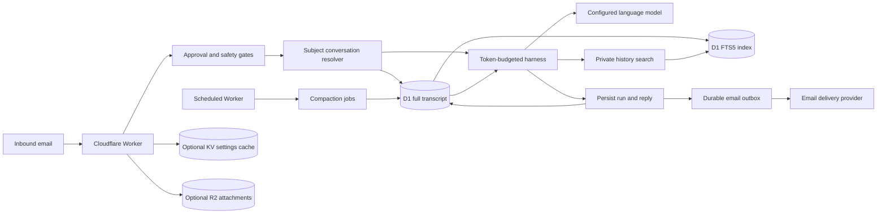

# AI Email Chatbot

An email-first AI assistant running on Cloudflare Workers. An approved sender emails the Worker, the model composes a response using bounded conversation context, and the Worker replies by email.

This repository is an email-first AI assistant with a durable, token-budgeted harness. The external capability registry is intentionally empty: there are no built-in action tools, custom MCP connections, browser actions, API actions, or external writes available to the model. The harness can compact older context into versioned D1 summaries and privately search the complete current conversation when recent context is insufficient.

## What runs where



| Concern | Runtime location | Current role |
| --- | --- | --- |
| Email ingestion and replies | `src/index.ts`, `src/providers/` | Active product path |
| Sender approval and identity | `src/data/users.ts`, `src/user/` | Active gate |
| Model request and response loop | `src/agent/loop.ts`, `src/providers/llm.ts` | Active core |
| Conversation identity | `src/data/memory.ts`, D1 | Subject-keyed; repeated `Re:`, `Fw:`, and `Fwd:` prefixes resolve together |
| Conversation memory | `src/data/`, D1 + FTS5 | Full messages remain authoritative; summaries and search index are derived |
| Compaction and recall | `src/data/compaction.ts`, `src/data/historySearch.ts` | Versioned summaries, retryable jobs, bounded private history search |
| Outbound delivery | `src/data/outbox.ts`, `src/providers/sendEmail.ts` | Active durable path |
| Admin control plane | `src/admin/` | Active model, email, safety, sender, and secret controls |
| Capability registry | `src/tools/registry.ts` | Intentionally empty |
| Fan-out and schema validation | `src/agent/`, `src/types.ts` | Dormant generic harness for a future capability |
| Custom MCP | Removed | No runtime or UI entry point |

## What happens to an email

1. The Worker requires D1, claims the message idempotently, and normalizes the sender.
2. Blocked, unapproved, rate-limited, or safety-guarded senders receive the appropriate controlled response.
3. The Worker parses the email, resolves the subject-based conversation, runs bounded emergency compaction when needed, loads recent context, and optionally stores inbound MIME attachments in R2.
4. The harness calls the configured model with no external tools. If enabled, the model may request the private `history_search` operation, which is ownership-scoped to the current conversation and capped per email.
5. The user message, model reply, run telemetry, and compaction queue state are stored in D1; the reply is queued and delivered.

The assistant remains useful as a conversational email chatbot without external tools. It must not claim to have performed an action it cannot perform.

## Core configuration

At minimum, production needs a D1 binding, an LLM provider, a delivery provider, `SENDER_EMAIL`, `ADMIN_PASSWORD_HASH`, and `ADMIN_SESSION_SECRET`. KV and R2 are optional. See [configuration](docs/CONFIGURATION.md).

Example model settings:

```toml
LLM_PROVIDER = "openrouter"
DEFAULT_LLM = "openrouter/free"
LLM_MODEL = ""
DELIVERY_PROVIDER = "brevo"
SENDER_EMAIL = "bot@example.com"
COMPACTION_TRIGGER_TOKENS = "8000"
COMPACTION_TARGET_TOKENS = "4000"
COMPACTION_KEEP_RECENT_TOKENS = "3000"
HISTORY_SEARCH_ENABLED = "true"
```

Store credentials as Wrangler secrets or through the encrypted Admin secret path. Never commit them.

## Local commands

```bash
npm install
npm run typecheck
npm test
npm run verify
npm run dev
```

Deploy after verification:

```bash
npx wrangler deploy --dry-run
npm run db:migrate
npm run deploy
```

Apply migrations `0029_capability_reset.sql` and `0030_harness_memory_foundation.sql` to an existing database. They clear seeded tool surfaces, disable old stored remote registrations, add subject-based memory, add the FTS5 index, and add token/compaction telemetry. Historical migrations are retained because D1 migrations are forward-only.

## Safety baseline

- The model receives bounded email/history context and untrusted-content instructions.
- D1 retains the complete original transcript; compaction only creates derived summary versions and never deletes messages.
- Full-history search is private, ownership-scoped, FTS5-first, LIKE-fallback, capped, and marked as untrusted model data.
- Token estimates use conservative UTF-8 bytes divided by three plus message overhead; provider usage is telemetry, not preflight authority.
- The registry is empty and configuration cannot invent a capability.
- Legacy `/tools`, `/mcp`, `/settings`, `/usage`, `/runs/*`, and `/conversations` operational routes are disabled.
- Admin and user sessions are separate, signed, CSRF-protected, and owner-scoped.
- Provider secrets are encrypted at rest and never returned to the browser.
- Inbound URLs are not fetched by the current product.
- KV is only an optional short-lived settings cache; it is not a history store.
- Internal fan-out is signed and replay-protected, but no capability currently dispatches through it.

## Adding the first capability later

Do not reintroduce a general integration catalog. Add one narrow capability only after defining:

- the user-facing reason it belongs in an email assistant;
- its exact input/output schema and byte limits;
- ownership and authorization rules;
- read versus user-write versus external-write behavior;
- provider/binding requirements and failure behavior;
- audit events, confirmation requirements, and regression tests;
- the README and “What runs where” update.

The registry is the only place a capability becomes visible to the agent. Until then, `allTools` remains `[]`.

## Documentation

- [Architecture](docs/ARCHITECTURE.md)
- [Configuration](docs/CONFIGURATION.md)
- [Admin control plane](docs/ADMIN.md)
- [User portal](docs/USER_PORTAL.md)
- [Providers](docs/PROVIDERS.md)
- [Security](docs/SECURITY.md)
- [Testing](docs/TESTING.md)
- [Operations](docs/OPERATIONS.md)
- [Fan-out harness](docs/FANOUT.md)
- [Removed MCP status](docs/MCP.md)
