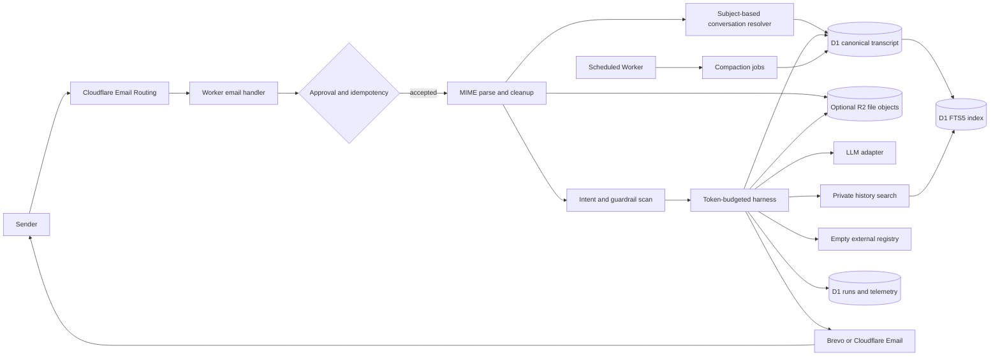
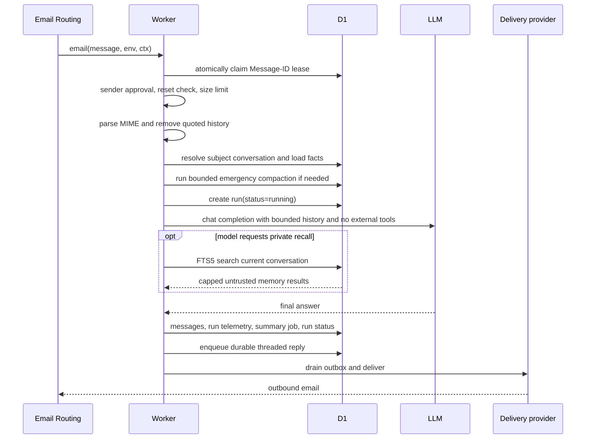
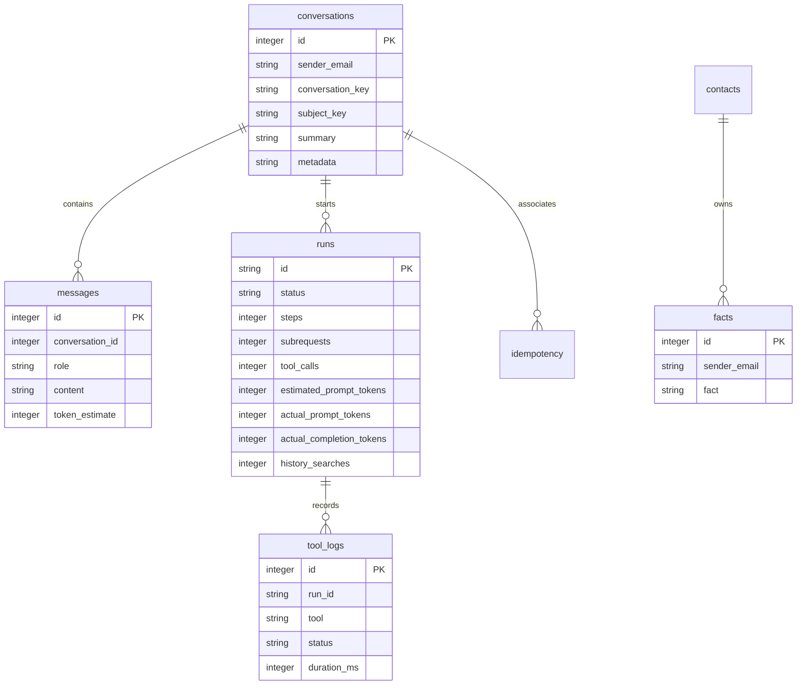
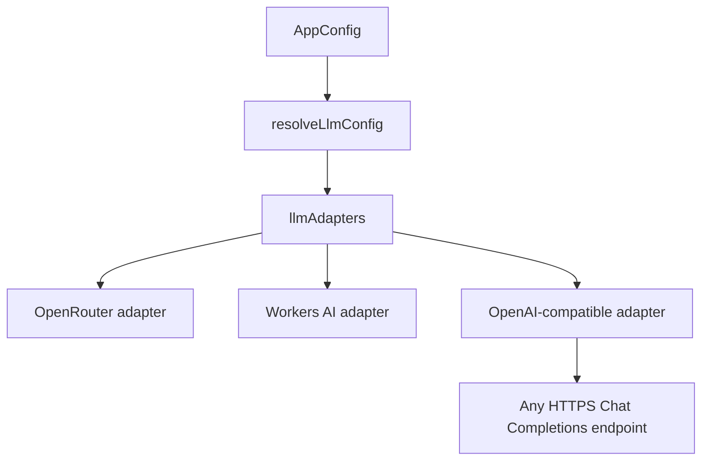
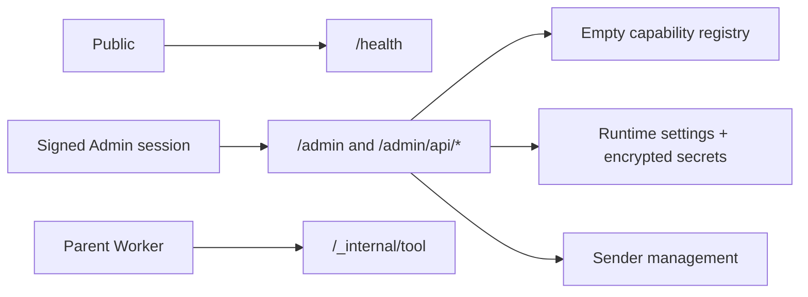

# Architecture and execution model

Tags: `#architecture` `#email` `#llm` `#agent` `#memory` `#observability` `#outbox`

This guide explains how an email becomes a reply, where state lives, which budgets apply, and where to add a new provider or tool.

## System map



The deployed entrypoint is `src/index.ts`. Cloudflare calls `email()` for routed messages, `fetch()` serves public health and authenticated Admin endpoints, and `scheduled()` purges rate events while draining the email outbox.

## Email lifecycle



The email event returns control to Cloudflare quickly. Processing continues through `ctx.waitUntil()`. A failed model or delivery stage records retry state. Delivery is protected by a unique outbox key, and the scheduled trigger retries pending delivery without re-running the model.

## Decision gates

| Gate | Question | Failure behavior |
| --- | --- | --- |
| Sender approval | Is the normalized sender approved and not suspended/declined/deleted? | Send bounded status response and stop |
| Idempotency | Can this normalized Message-ID be claimed, or has its lease expired? | Ignore an active duplicate; retry an expired/failed claim |
| Rate limit | Is the sender and global daily budget available? | Send a rate-limit reply |
| Size | Is the raw message under 2 MB? | Fail the run with `email-too-large` |
| Memory | Is D1 available? | Stop email processing; approval and ownership require D1 |
| Provider | Is the selected LLM configured? | Return a controlled model failure |
| Capability | Is a registered capability available? | Current registry is empty; return a normal model answer without tools |
| Guardrail | Does input or output contain injection indicators? | Label it as untrusted data |
| Delivery | Is Brevo or Cloudflare Email configured? | Keep the outbox row failed and retry with backoff |

## Agent loop

`src/agent/loop.ts` retains two future model behaviors:

1. Native OpenAI-style `tool_calls` for models that support them.
2. A manifest fallback, where the model emits `[TOOL(name)] {json}` lines.

With the current empty external registry, each cycle performs the model call and final-response path, with optional private history recall:

```mermaid
flowchart TD
  start[Messages and empty external registry] --> budget{Wall and subrequest budget?}
  budget -->|no| stop[Return bounded partial reply]
  budget -->|yes| call[Call selected LLM]
  call --> parse[Parse native or manifest tool calls]
  parse --> answer{Any calls?}
  answer -->|no| done[Return answer]
  answer -->|private history search| recall[Scoped FTS5 recall]
  recall --> budget
  answer -->|future external capability| validate[Validate future capability]
  validate --> stop
```

The parent counts one subrequest for each LLM call and one for each requested tool call. A child Worker invoked through fan out has its own invocation budgets, but the parent still counts the dispatch as one tool call. This prevents a model from creating unbounded work in the parent while allowing independent child invocations to use their own platform limits.

### Budget defaults

| Budget | Default | Configurable ceiling | Enforced by |
| --- | ---: | ---: | --- |
| Agent cycles | 8 | configured | `MAX_AGENT_STEPS` |
| Parent subrequests | 40 | configured | `SUBREQUEST_BUDGET` |
| Parent wall time | 900 seconds | per invocation | `runAgent()` |
| Parallel tools | 4 | configured | `parallelTools` config |
| Tool call timeout | 20 seconds | 20 seconds per call | `withTimeout()` |
| Tool result | 8 KiB | configured | `MAX_TOOL_RESULT_BYTES` |
| Model context | 12,000 tokens | configured | conservative estimator and fitter |
| Model output | 2,000 tokens | configured | provider `max_tokens` request |
| History search | 2 calls/email | configured | internal harness budget |
| Raw inbound email | 2 MB | 2 MB | `parseMessage()` |

## Data model



D1 is the source of truth for durable identity, configuration, the complete original conversation history, run history, summary versions, compaction jobs, FTS5 retrieval index, file metadata, and usage. R2 stores user-scoped binary files for a short retention period; only metadata and authenticated references enter D1 messages. KV is an optional short-lived settings/cache layer; it does not grant capabilities and never owns transcript history.

The archive and context are separate layers. D1 keeps every message, while `buildConversationBuffer()` selects the current rolling summary plus a bounded recent window for the model. `message_fts` is a derived index maintained by D1 triggers and searches only the current subject conversation after ownership filters. A scheduled compaction job creates a versioned summary over the oldest complete turns after the conservative token threshold is crossed; failures degrade to a bounded extractive summary and remain retryable. Deleting history removes the D1 transcript and the corresponding R2 objects; it does not rely on model context truncation as a deletion mechanism.

### Memory and compaction invariants

- `conversation_key` is unique per sender and canonical subject. Empty subjects use the legacy fallback key.
- `messages` is append-only application memory. Compaction never deletes or rewrites transcript rows.
- A summary stores source ranges, source/summary token estimates, model/config identity, structured JSON, rendered text, degradation status, and its superseded summary ID.
- History-search output is explicitly untrusted, bounded by result tokens, and never placed in logs as full message content.
- The scheduled Worker claims compaction jobs with a lease, exponential retry delay, and permanent-failure state.

## Provider boundary

`src/providers/llm.ts` exposes a common `LlmResponse` shape. Provider selection happens in `resolveLlmConfig()` and dispatch happens through `llmAdapters`.



The generic adapter normalizes either a provider root such as `/v1` or a complete `/chat/completions` URL. It sends standard `messages`, optional function schemas, `tool_choice`, model, bearer authentication, and optional JSON extra headers. It parses string content, content parts, native tool calls, and usage counters.

## Capability boundary

A future capability is a `ToolDef` with a name, description, strict JSON-schema-like parameters, ownership, availability requirements, category, effect metadata, and a bounded `run()` function. The registry is the only place where capabilities become visible to the agent. The current registry is intentionally empty. `toolAvailability()` and the agent validator remain as harness primitives; configuration cannot invent a capability.

Custom MCP support has been removed. Historical database tables are not read by the agent or exposed through the control planes.

## HTTP surface



`/_internal/tool` is checked with an HMAC signature, a five-minute timestamp window, and a one-time D1 request ID. Legacy operational routes return `410`; `/health` is the only public diagnostic route.

## Extension recipes

### Add an LLM provider

1. Add a provider type and adapter in `src/providers/llm.ts`.
2. Add environment fields to `src/env.ts`.
3. Add selection logic in `resolveLlmConfig()`.
4. Normalize provider errors into `LlmResponse`.
5. Test URL, headers, request body, response content, tool calls, timeout, and retry behavior.
6. Document the provider and its secret in `docs/CONFIGURATION.md`.

### Add a built-in tool

1. Define strict parameters and a bounded output.
2. Use `ctx.fetch` so tests can inject an upstream.
3. Validate outbound URLs with the shared guardrail when accepting URLs.
4. Add availability requirements if the tool needs a binding or secret.
5. Register it in `src/tools/registry.ts`.
6. Add a focused test and list it in the tool documentation.

### Add a persistent feature

Create a forward-only migration, add a small data module that uses `Db`, account for reads and writes, expose only the minimum HTTP surface, and document deletion behavior. Avoid putting per-message durable state in KV.
