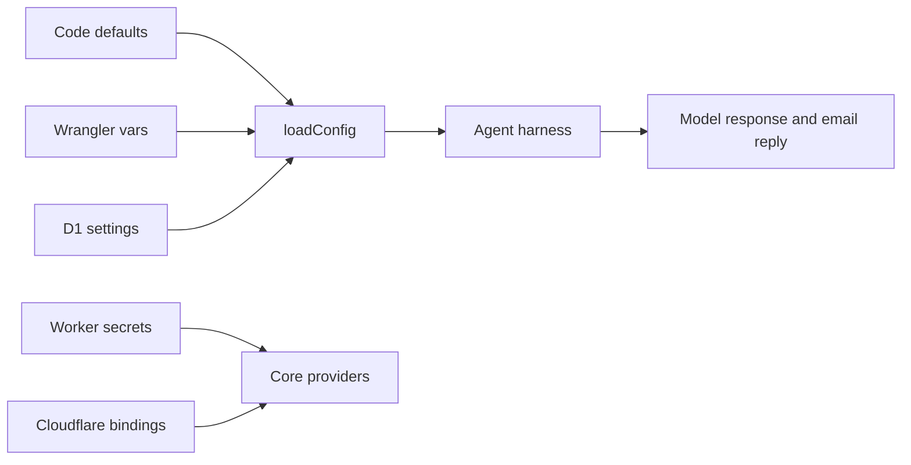

# Configuration reference

Configuration has four layers: code defaults, Wrangler variables, D1 runtime settings, and encrypted provider secrets. D1 behavior settings are applied at invocation time. Bindings and the two Admin bootstrap secrets remain deployment configuration.



## Core pieces

| Piece | Required for | Configuration |
| --- | --- | --- |
| `DB` | Approval, durable memory, Admin, outbox, rate limits | Wrangler D1 binding |
| `CHAT_MEMORY` | Optional derived-data cache | Wrangler KV binding |
| `R2` | Inbound attachment retention | Wrangler R2 binding |
| LLM provider | Model replies | Variables + secret or `AI` binding |
| Delivery provider | Email replies | Variables + secret or `EMAIL` binding |
| `SENDER_EMAIL` | Outbound replies | Variable/runtime setting |
| `ADMIN_PASSWORD_HASH` | Admin login | Worker secret |
| `ADMIN_SESSION_SECRET` | Sessions and encrypted secrets | Worker secret |

The capability registry is empty. No setting, binding, secret, or Admin action can create a tool. Custom MCP configuration is not supported.

## Provider examples

```toml
LLM_PROVIDER = "openrouter"
DEFAULT_LLM = "openrouter/free"
LLM_MODEL = ""
```

```bash
npx wrangler secret put OPENROUTER_API_KEY
```

For Workers AI, set `LLM_PROVIDER = "workers-ai"`, choose `LLM_MODEL`, and add the `AI` binding. For an OpenAI-compatible provider, set `OPENAI_COMPATIBLE_BASE_URL` and `OPENAI_COMPATIBLE_MODEL`, then store `OPENAI_COMPATIBLE_API_KEY` as a secret.

## Email settings

`DELIVERY_PROVIDER` is `brevo` or `cf-send-email`; `BREVO_API_KEY`, `EMAIL`, `SENDER_NAME`, and `SENDER_EMAIL` configure delivery. `spam_email_domains` is a D1 blocked-domain list. Subject-trigger fields remain compatibility metadata and do not gate approved senders.

## Harness limits

`MAX_RAW_EMAIL_BYTES` is a hard 2 MB parser boundary. `MAX_AGENT_STEPS`, `subrequest_budget`, context caps, rate limits, compaction settings, and `guardrail_strictness` protect processing. They do not enable tools. D1 is the authoritative transcript store; R2 is inbound attachment storage only; no URL-fetch capability exists.

## Token budgets and durable memory

`context_caps` is a D1 JSON setting. Its canonical fields are approximate token budgets:

```json
{"systemTokens":1600,"summaryTokens":2000,"recentHistoryTokens":4000,"emailTokens":6000,"attachmentTokens":2000,"toolOutputTokens":1600,"modelContextTokens":12000,"outputTokens":2000}
```

The estimator uses conservative UTF-8 bytes divided by three plus message/protocol overhead. The context fitter removes oldest complete turns first, preserves the system and newest email when the configured budget permits, and hard-caps the final request. Legacy byte-oriented JSON field names are accepted as a migration convenience but are no longer the documented interface.

Compaction settings are:

| Setting | Default | Purpose |
| --- | ---: | --- |
| `compaction_enabled` | `true` | Enable queueing and emergency preflight compaction |
| `compaction_trigger_tokens` | `8000` | Approximate durable-history threshold |
| `compaction_target_tokens` | `4000` | Target old-history remainder after selection |
| `compaction_keep_recent_tokens` | `3000` | Minimum raw recent history to preserve |
| `compaction_output_tokens` | `1200` | Summary model output ceiling |
| `compaction_llm_provider` | empty | Optional provider override |
| `compaction_llm_model` | empty | Optional model override |
| `compaction_llm_base_url` | empty | Optional OpenAI-compatible endpoint override |

History recall settings are `history_search_enabled` (`true`), `history_search_max_calls` (`2`), `history_search_max_results` (`8`), and `history_search_result_tokens` (`1600`). Environment fallbacks use the corresponding uppercase names such as `COMPACTION_TRIGGER_TOKENS` and `HISTORY_SEARCH_MAX_CALLS`.

Compaction writes versioned derived rows to `conversation_summaries` and retryable work to `compaction_jobs`. The original `messages` rows remain the canonical archive. The private history operation searches the current subject-based conversation through D1 FTS5, with a bounded LIKE fallback; it is not an external tool or MCP capability.

## Temporary configuration

`npm run deploy:temporary` resolves temporary D1 and KV, writes an ignored generated config, applies migrations, deploys with `--temporary`, and uploads fresh Admin bootstrap secrets. Temporary accounts omit optional R2 and scheduled bindings. KV is only a short-lived settings cache; D1 owns all transcript, summary, and search data.

Never put API keys in `[vars]`, source files, or documentation examples. Use Wrangler secrets or the encrypted Admin secret path.
