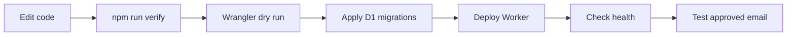

# Operations and deployment

## Release sequence



```bash
npm run verify
npx wrangler deploy --dry-run
npm run db:migrate
npm run deploy
curl https://YOUR_WORKER/health
```

Migrations are forward-only. Apply `0029_capability_reset.sql` and `0030_harness_memory_foundation.sql` to existing databases. The latter adds subject-keyed conversations, message token estimates, FTS5 recall, versioned summary metadata, compaction token settings, and run telemetry.

## Temporary environment

`npm run deploy:temporary` creates or reuses temporary D1/KV resources, applies migrations, deploys, and uploads fresh Admin bootstrap secrets. Temporary accounts omit optional R2 and scheduled bindings.

## Health and logs

`/health` confirms the Worker is reachable and reports binding/model/delivery state. The health response reports zero active capabilities. `npx wrangler tail` shows runtime errors without exposing credential values.

With D1, each email run records its UUID, model, status, steps, subrequests, external tool calls, estimated prompt tokens, provider-reported usage when available, dropped context items, and private history-search count. The scheduler drains email login/reply outboxes, compaction jobs, rate-event cleanup, and expired files.

Compaction is healthy when `compaction_jobs` is mostly empty or `succeeded`, with no growing `failed`/`permanent_failure` queue. The Admin overview exposes queue counts and redacted failure metadata. A foreground email performs one bounded emergency preflight if its durable conversation crosses the trigger and background work has not caught up. Semantic summary failure produces a bounded extractive summary marked degraded and leaves the job retryable; original messages remain available for later regeneration.

For recall incidents, inspect the FTS5 table/triggers and use the LIKE fallback behavior. Search is always scoped by approved user and conversation ID. Do not copy full retrieved messages into logs.

## Recovery

Deploy the previous Worker version or restore the previous source revision. Do not roll back across a migration unless the old code tolerates the new columns. During investigation, keep the registry empty and verify the core email-to-model-to-email path before adding any capability.
